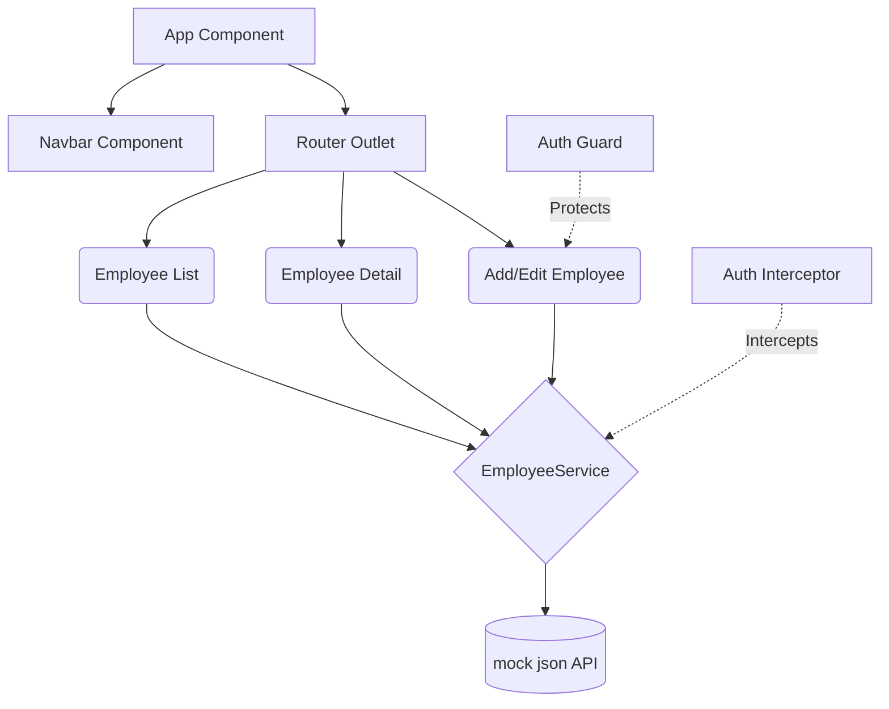

# Employee Dashboard

A feature-rich Angular application for managing employees.

## Architecture

The application is structured into the following scalable components:



## Setup Instructions

1. **Install Dependencies**
   If you haven't already:
   ```bash
   npm install
   ```

2. **Start the Development Server**
   ```bash
   ng serve
   ```
   Or `npm start`.

3. **Open the Application**
   Navigate to `http://localhost:4200/` in your browser.

## Features Implemented
- **Services & Routing**: Developed `EmployeeService` utilizing Dependency Injection. Includes `app.routes.ts` providing navigation between Home, Details, Add, and Edit forms. Built an `AuthGuard` for mock authentication.
- **Pipes & Directives**: Programmed a `departmentFilter` pipe for table filtering, standard pipes for Salary and Date formatting, and a `[appHighSalary]` custom directive for highlighting rich records.
- **Forms & Reactive Programming**: Uses Reactive Forms for the Add/Edit form, integrated with Angular validations (Required, MinLength, Email Regex). Employs `HttpClient` and RxJS Observables to fetch simulated data from a JSON store, governed by an HTTP Interceptor.
- **Angular Material**: Entirely designed with Material UI components (`MatToolbar`, `MatCard`, `MatTable`, `MatButton`, `MatFormField`). Includes Material specific theming.

## Deliverables Included
- Complete Angular project source code 
- Components: Employee List, Employee Detail, Add/Edit Employee, Navbar
- Integration with Angular Material (tables, forms, dialogs)
- JSON-based data fetching and CRUD simulation (`public/employees.json`)
- Documentation (README file) with setup instructions and architecture diagram
